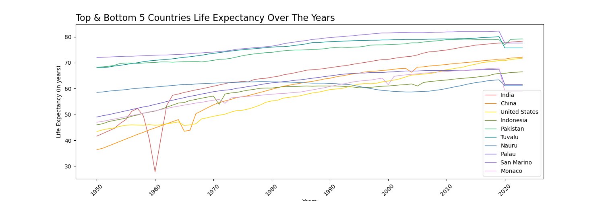

# Project 1: World Development Statistics

_A note to consider: As you peruse this repository, bear in mind that this marked my humble beginning into the realm of data science. I find it valuable as a reflection of my journey, illustrating both my starting point and the progress I have made since then._

### More people, more problems?

Oscar the Grouch seems to think so. Disliking anyone who walks by his trash can, Oscar has developed a conviction that the constant presence of so many people is detrimental to his well-being. Consequently, he has enlisted my services to look into and address this apprehension on his behalf.

<p align="center">
  
</p>


Undoubtedly, our global lifespan has extended beyond that of our ancestors from the early 1900s, and our population is growing at an exponential pace. Yet, a critical question arises: is our life expectancy now on the decline? The connection between a nation's population size and the average lifespan of its inhabitants remains uncertain within the context of the human race. This project aims to investigate the relationship between a country's population and the average lifespan, and provide evidence to support or oppose the the claim that exponentially growing populations are shortening the average lifespan.


### File Directory:

```
CAPSTONE
|__ code
|   |__ clean_code.ipynb 
|__ data
|   |__ gni_per_cap_atlas_method_con2021.csv
|   |__ life_expectancy.csv
|   |__ population.csv
|__ images
|   |__ bottom_5_life_bar.png
|   |__ bottom_5_life_line.png
|   |__ bottom_5_pop_bar.png
|   |__ bottom_5_pop_line.png
|   |__ countries_life_bar.png
|   |__ countries_life_line.png
|   |__ countries_pop_bar.png
|   |__ coountries_pop_line.png
|   |__ Oscarthegrouchy.png
|   |__ top_5_life_bar.png
|   |__ top_5_life_line.png
|   |__ top_5_pop_bar.png
|   |__ top_5_pop_line.png
|__ Capstone - Kiersten Johns.pdf
|__ README.md
```


# Data Dictionary


|Feature|Type|Dataset|Description|
|---|---|---|---|
|**country**|*object*|Gapminder| The name of all 195 countries in the world
|**population size**|*object*|Gapminder|The population of all of the 195 countries in the world (units represented with abreviations "K", "M", and "B") from the year 1800 to the projected future of 2100|
|**life expectancy**|*float*|Gapminder|The average life expectancy of all 195 countries in the world from 1800 to the projected future of 2100|


# Outside Research


Upon delving deeper into the subject, it appears that Oscar is not alone in pondering this question. Greeley G. (“Gregg”) Miklashek, MD, a retired neuropsychiatrist, stress researcher, and author of "STRESS R US," appears to share Oscar's perspective.

In the article *[Population Density Stress Is Killing Us Now!](https://mahb.stanford.edu/blog/population-density-stress-killing-us-now/)*, author Gregg Miklashek summarizes that, 
>"human overpopulation and our modern life-style choices are causing physiological changes responsible for our top ten killing “diseases of civilization”"

# Executive Summary

Therefore, is there a connection between the overall population and the lifespan of a nation's residents? My findings indicate that there is no correlation between population size and the life expectancy of those residing in these environments. I am pleased to affirm that Oscar can rest assured in his trash can, understanding that although the presence of others may cause stress, it will not result in an early demise for him.

As a reminder, in this project I compared data on the topics of population and life expentency for the top 5 most and least populated countries in the world in the year of 2023. These World Development Statistics of all 195 countries around the world derive from [Gapminder](https://www.gapminder.org/about/). Once the data was imported, I computed the top and bottom 5 countries with the highest and lowest population recorded for the year of 2023. The top 5 countries with the largest population in 2023 are India, China, United States, Indonesia, Pakistan. The bottom 5 countries with the smallest population in 2023 are Tuvalu, Nauru, Palau, San Marino, Monaco. Once I had those countries established, I created new dataframes that included only the top 5 or bottom 5 countries. For all of the bottom 5 countries, life expectancy data was missing from the years of 1800 to 1950. Population was recorded at this time, so this could just be due to no or lost recording of this information. Originally I had the thought to fill in the missing life expectancy data with the average of that countries life expectancy, but after I saw what that looked like in a visual representation I decided that was not the correct avenue to pursue. Therefore, I decided to only explore data from 1950 to current day. 

In the figures I created, I explored the top and bottom 5 countries on their own as well as together between the years of 1950 to the current year of 2023. The figure titled "Top & Bottom 5 Countries Life Expectancy Over The Years" paints a pretty clear picutre. In this figure we can see that outside of Pakistan (top 5), Tuvalu (bottom 5), and San Marino (bottom 5), the other 7 countries tend to follow the same trend and trajectory. It is worth noting that those 3 countries, Pakistan, Tuvalu, and San Marino, have always had a much higher life expectancy within the years that have been explored. 

<p align="center">
  
</p>


Below is a list of some recommendations / further explorations:
- What is healthcare like in all 10 countries? How does that play a role in the life expectancy?
- What are those 3 countries (Pakistan, Tuvalu, and San Marino) doing differently than the rest to have such a high avg lifespan?
- The 3 countries with the high life expectancy are not located near eachother, yet they follow the same trend. Why?
- When were these countries established? Does that have any correlation to life expectancy? 
- In 1960 there was a massive dip in life expectancy in India, why is that?


# Sources

- [Gapminder](https://www.gapminder.org/)
- [Population Density Stress Is Killing Us Now!](https://mahb.stanford.edu/blog/population-density-stress-killing-us-now/)
- [Geeksforgeeks](https://www.geeksforgeeks.org/)
